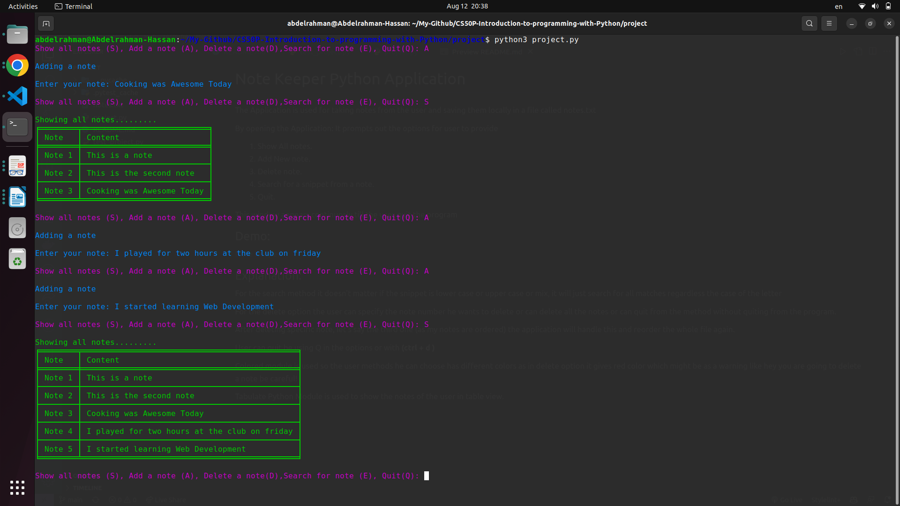
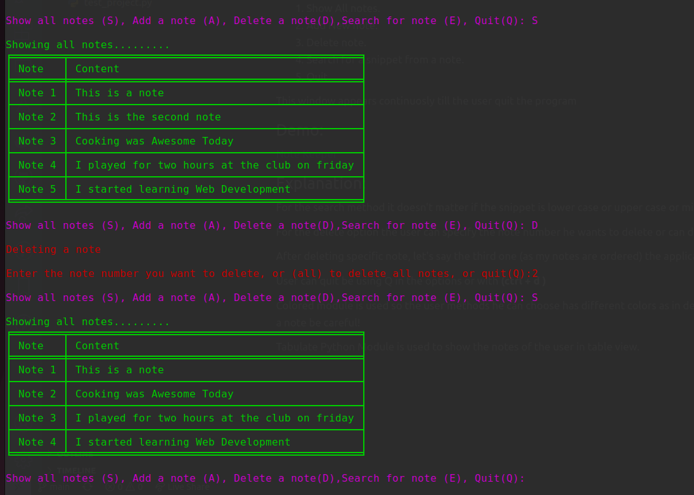
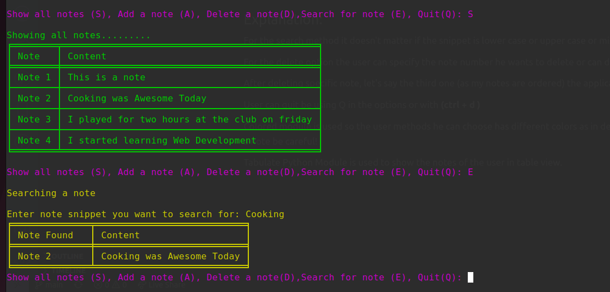

# Note Keeper Python Application

The Application is used for taking notes from the user and saving them locally in a file called notes.txt

By opening the Application: It prompts out the options for user to provide

<ol>
<li>Show All notes.</li>
<li>Add New note.</li>
<li>Delete note.</li>
<li>Search for a snippet from a note.</li>
<li>Quit.</li>
</ol>

This window appears continuosly till the user quit the program

## Demo:

<a href="https://www.youtube.com/watch?v=9S6gvhdkJns">Note Keeper</a>

## Explanation:

For the search method it doesn't matter if the snippet is lower case or upper case or mix, it will just search for all matches regardless the case of the letter

For the delete option the user can specify the note number he wants to delete or can delete all the notes or can quit from the method without quiting from the program.

After deleting specific note, let's say the third one (as my notes are ordered) the application will handle this and reorder the whole file again.

User can quit be using Q in the options or with <strong>(ctrl + d )</strong>

Colored module is used so the user methods he can choose has different colors as in delete option it gives red color which might be as a warning like hey you are going to delete a note be careful!

Tabulate Python Module is used to show the notes of the user in table view.

## Screenshots:

> showing some stored notes and adding new notes

> Deleting specific note and program reorders the notes

> Searching for a specific word in notes

## challenges:

<ol>
<li>
How to keep the app storing old notes => using open method to store notes locally in a file
</li>
<li>
How to write new note without deleting or affecting the previous ones => using <strong>"a"</strong> option in the open file method
</li>
<li>
Reordering the notes' numbers after deleting any note.
</li>
</ol>
